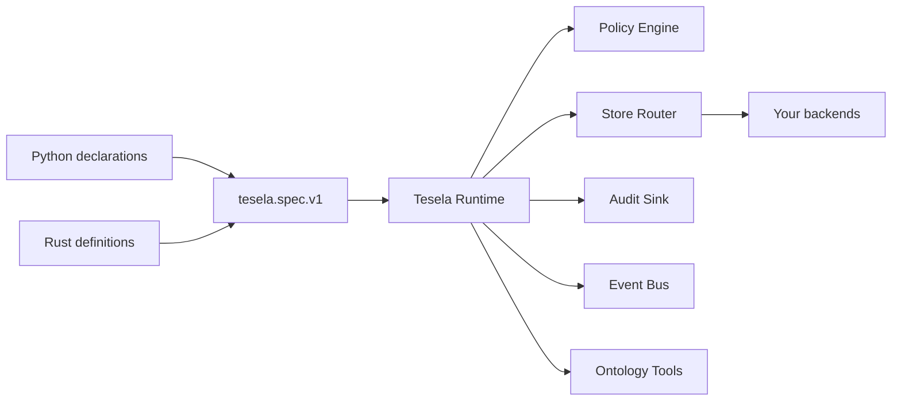

<div align="center">

# Tesela

**Build ontology-driven applications without surrendering your infrastructure.**

Define your domain once. Bring your own data stores, policies, and infrastructure.  
Run everything through a native Rust runtime with first-class Python bindings.

[](https://github.com/miguelcsx/tesela/actions/workflows/ci.yml)
[](LICENSE)


</div>

Tesela is an embeddable runtime for building applications around a **shared ontology** instead of hard-coding domain semantics into services, databases, or API layers.

Model objects, relationships, actions, policies, and reusable object sets as a canonical `tesela.spec.v1` specification. Tesela validates that model and exposes a consistent runtime for querying, mutation, traversal, aggregation, actions, and agent integrations.

Your data stays where it already lives. Tesela does not require a specific database, warehouse, transport, identity provider, or deployment model.

## Why Tesela?

- **One canonical ontology** — Python declarations, Rust definitions, and JSON specs lower to the same `tesela.spec.v1` representation.
- **Bring your own backend** — connect databases, APIs, warehouses, or application services through a small store contract.
- **Policy-aware by construction** — every runtime operation carries an explicit actor and is evaluated by a configured policy engine.
- **Native runtime** — the execution core is written in Rust; Python embeds that runtime directly rather than talking to a separate Tesela service.
- **Relationships as first-class primitives** — model links and traverse them through the same runtime used for ordinary objects.
- **Actions, not just data** — declare domain actions and delegate execution to the backend that owns the subject.
- **Agent-ready** — expose ontology-aware tools with JSON schemas, approval requirements, and side-effect metadata.
- **Infrastructure-neutral** — Tesela is a library, not a hosted platform. Storage, authentication, transports, and deployment remain yours.

## Architecture



The ontology describes **what exists and how it relates**. The runtime defines **how applications interact with it**. Your adapters decide **where the data and business operations actually live**.

## Quick start

### Python

Clone the repository and install the native Python package:

```bash
git clone https://github.com/miguelcsx/tesela.git
cd tesela
python -m pip install -e sdk/python
```

Define an ontology using ordinary Python types:

```python
from tesela import MemoryStore, Runtime, Spec

spec = Spec("demo")
spec.datasource("memory")

@spec.object_type(datasource="memory", primary_key="id")
class Customer:
    id: str
    email: str | None
```

Create a runtime:

```python
runtime = Runtime(
    spec,
    stores={"memory": MemoryStore()},
    policy="allow_all",
)

actor = {"user_id": "local"}
```

Operate on the ontology:

```python
runtime.mutate(
    "customer",
    {
        "create": {
            "values": {
                "id": "cust_001",
                "email": "hello@example.com",
            }
        }
    },
    actor=actor,
)

customer = runtime.get(
    "customer",
    "cust_001",
    actor=actor,
)

print(customer["values"])
```

`MemoryStore` and `policy="allow_all"` are intended for trusted local development. Production applications should provide their own stores and policy engine.

## The ontology

A Tesela specification can describe:

| Primitive | Purpose |
| --- | --- |
| **Datasources** | Logical sources mapped to runtime stores |
| **Object types** | Domain entities and their properties |
| **Traits** | Reusable structural definitions |
| **Link types** | Relationships between object types |
| **Object sets** | Named, reusable sets of objects |
| **Actions** | Domain operations and their metadata |
| **Roles** | Role definitions carried by the ontology |
| **Policies** | Declarative authorization metadata |

Python decorators provide a concise interface for common definitions, while `Spec.add(...)` exposes the complete canonical IR when lower-level control is required.

The resulting specification can be serialized, validated, stored, generated, or applied to an existing runtime:

```python
document = spec.to_json()

runtime.apply_spec(spec)
```

## Bring your own data

Tesela deliberately does not own your persistence layer.

A Python store provides five core operations:

| Operation | Responsibility |
| --- | --- |
| `search` | Query an object type |
| `get` | Fetch one object |
| `create` | Create an object |
| `update` | Update an object |
| `delete` | Delete an object |

Stores can additionally expose:

- `aggregate`
- `traverse`
- `execute_action`

That makes the runtime independent of whether your ontology is backed by PostgreSQL, a graph database, a warehouse, an internal API, an existing service, or several systems at once.

## Policy and security

Tesela requires an explicit policy engine when constructing a runtime.

Every operation includes an actor:

```python
runtime.search(
    "customer",
    actor={"user_id": "alice"},
)
```

A production policy implementation exposes:

```text
evaluate(request) -> decision
```

and returns a decision containing at least `allow`.

Authentication itself remains outside Tesela. Your application is responsible for establishing actor identity and for transport security, tenant isolation, credentials, encryption, and other deployment-level controls.

Optional audit and event ports can be attached to the runtime:

```text
audit.record(event)
events.publish(event)
```

See [SECURITY.md](SECURITY.md) for the security boundary and reporting policy.

## Actions

Ontologies can describe operations in addition to data.

```python
@spec.action(subject="customer")
def deactivate_customer(customer_id: str):
    ...
```

Action declarations describe the ontology-facing contract. Execution belongs to the store backing the action's subject through `execute_action`.

This keeps business operations close to the systems that actually own them while allowing the rest of the application to discover and invoke them through a shared semantic layer.

> **Current v1 contract:** declared policy rules and action schemas are ontology metadata. Runtime authorization is performed by the configured policy engine, while action execution and application-specific payload validation remain the responsibility of the executing backend.

## Agent integrations

Tesela includes ontology-aware tool definitions designed for agent runtimes.

```python
from tesela import tool_definitions

tools = tool_definitions()
```

Built-in tools cover:

- ontology inspection
- object search
- record lookup
- aggregation
- object-set resolution and composition
- link discovery
- relationship traversal
- action discovery and description

Tool definitions include machine-readable input schemas together with approval and side-effect metadata, allowing an agent layer to reason about ontology operations without inventing a separate domain API.

Tesela provides the tools; model providers, orchestration frameworks, transports, and approval UX remain application concerns.

## Rust

Tesela's runtime and canonical IR are implemented in Rust.

Until the first published release, depend directly on the repository:

```toml
[dependencies]
tesela = { git = "https://github.com/miguelcsx/tesela" }
```

Declarative macros are enabled by default:

```rust
use tesela::ObjectType;

#[derive(ObjectType)]
#[tesela(datasource = "main", primary_key = "id")]
struct Customer {
    id: String,
    email: Option<String>,
}
```

The facade exposes the ontology IR, runtime, store contracts, core types, and declarative macros through a single crate.

## Workspace

Tesela is split into focused crates:

| Package | Responsibility |
| --- | --- |
| [`tesela-core`](crates/tesela-core) | Shared identifiers, values, errors, and core types |
| [`tesela-ir`](crates/tesela-ir) | Canonical ontology representation |
| [`tesela-store`](crates/tesela-store) | Store, policy, audit, event, and query contracts |
| [`tesela-runtime`](crates/tesela-runtime) | Ontology runtime and agent-facing tools |
| [`tesela-macros`](crates/tesela-macros) | Declarative Rust macros |
| [`tesela`](crates/tesela) | Public Rust facade |
| [`sdk/python`](sdk/python) | Native Python bindings |

The Python package is built with PyO3 and Maturin and embeds the same Rust runtime exposed by the Rust API.

## Performance

Tesela keeps the runtime native and intentionally leaves backend execution to the systems best suited for it.

The repository includes a reproducible baseline covering spec parsing and serialization, search, lookup, and mutation across both the Rust API and Python bindings.

See [benchmarks/README.md](benchmarks/README.md) for methodology and current measurements.

## Development

Requirements:

- Rust stable
- Python 3.10–3.13
- Maturin
- pytest
- Python build tooling

Build everything:

```bash
make build
```

Run the full test suite:

```bash
make test
```

Run the complete local pre-push gate:

```bash
make verify
```

`make verify` checks formatting, Clippy, Rust tests, Rust packaging, Python tests, Python package builds, documentation links, and release-version consistency.

## Philosophy

Tesela keeps a deliberately small boundary:

**Tesela owns the ontology contract and runtime semantics. Your application owns its infrastructure.**

That means no mandatory database, no generated service architecture, no hidden network layer, and no requirement to move existing systems behind a new platform.

Use Tesela as the semantic runtime underneath the application you already want to build.

## License

Tesela is licensed under the [Apache License 2.0](LICENSE).
